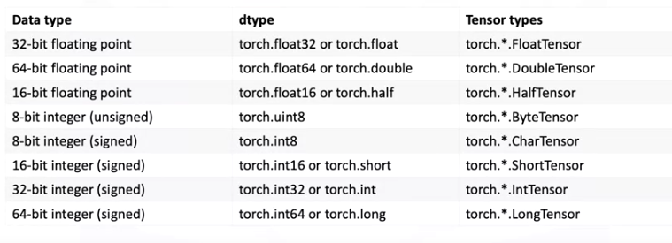

# Tensors and datasets

## Quick overview of Tensors


## Definitions:
- Tensor: a Pytorch tensor's a data structure that's generalization for numbers and dimensional arrays

## 1D Tensors
- [1D LAB](1.1_1Dtensors_v2.md)


Tensors are ssentially arrays that're the building blocks of a neural networks

Types of tensors given by dimention:

- 0-D: 1,2,0.2,10
- 1-D tensor is and array of numbers:
  - A row in a database
  - A vector
  - Time series


A tensor contains elements of a single data type, the tensor type is the type of tensor:


Cheet cheat

```python
import pytorch

a = torch.tensor[2,4,5,32,5]

b= torch.tensor([0.0,0.1,0.2]) 

#getting the tensor datatype
print(b.dtype)

#specify dtype

c = torch.tensor([0.0,0.1,0.2],dtype=torch.int32)

#explicity using dtype
d = torch.FloatTensor([1,2,3,4])

#converting tensor
a = a.type(torch.FloatTensor)

#getting the size and dimention of a tensor
e = torch.FloatTensor([1,2,3,4]
e.size() # torch.size(5)
e.ndimension() # 1

#converting 1-d to 2-d tensors using view method
f = torch.tensor([1,2,3,4])

f_col = f.view(5,1)
#if we didn't now the size
f_col = f.view(-1,1)

#pytorch tensors to numpy arrays 
import numpy as np

np_array =np.array([0.0,0.1,0.2])
torch_tensor = torch.from_numpy(numpy_array)
back_to_numpy = torch_tensor.numpy()

#omg pointers again :o

import pandas as pd

#pandas series to tensor
pandas_series = pd.series([1,2,3,4,5])
pandas_to_torch = torch.from_numpy(pandas_series.values)

#converting tensor to a list
this_tensor = torch.tensor([0,1,2]) 

torch_tolist = this_tensor.tolist()

#indexing tensors

new_tensor = torch.tensor([5,3,42])

new_tensor[0] # tensor(5)
new_tensor[1] # tensor(3)

# using .item you can return a number
new_tensor[0].item()

```

Indexing and slicing
```python
t = torch.tensor([5,3,42,54,2,3,5])
t[0] = 100

#slicing
d = c[1:5]

#replacing values by slicing
d[3:5] = torch.tensor([1,2])

```

Basic operations
```python
#vector addition and substraction
#term by term

#has to be the same dtype
u = torch.tensor([1.0,0.0])
v = torch.tensor([0.0,1.0])

z = u+v # tensor([1,1])

#broadcasting
u = torch.tensor([1, 2, 3, -1])

v = u + 1 # [2,3,4,0]


#vector multiplication by scalar
y = torch.tensor([1,2])
x = 2*y

#product of two tensors
u = torch.tensor([1,2])
v = torch.tensor([3,2])

z = u*v # [3,4]

#dot product uT*V
u = torch.tensor([1,2])
v = torch.tensor([3,2])
result = torch.dot(u,v) #5
```
Appliying functions to tensors

```python
#mean
a = torch.tensor([1,-1,1,1])
a.mean()

#max
a = torch.tensor([1,-1,1,1])
a.max()

#map
np.pi
x = torch.tensor([0,np.pi/2,np.pi])
y = torch.sin(x) # [0,1,0]

#linsoace
torch.linspace(-2,2,steps=5)
#[-2,-1,0,1,2]
torch.linspace(-2,2,num=9)
#[-2,-1.5,-1,-0.5,0,0.5,1,1.5,2]

#plotting math functions
x = torch.linspace(0,2*np.pi,100)
y = torch.sin(x)

import matplotlib.pyplot as plt
#convert to numpy array
plt.plot(x.numpy(),y.numpy())
```